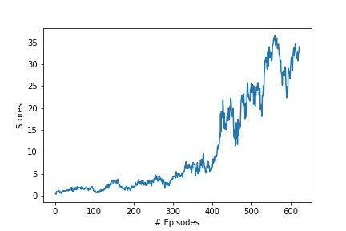

# Project 2: Continuous Control

The project applies policy-based RL methods to learn the optimal policy in Unity environment setting. The agent receive a reward of +0.1 for each step that the hand is in the goal location such that the agent aims to maintain its position at the target location for as long as possible.

The observation space consists of 33 variables corresponding to position, rotation, velocity, and angular velocities of the arm. Each action is a vector with four numbers, corresponding to torque applicable to two joints. Every entry in the action vector is a number between -1 and 1.


The following report is written in four parts:

- **Implementation**

- **Results**

- **Ideas for improvement** 

  

## Implementation

The basic algorithm applied is actor-critic. Policy-based methods, such as REINFORCE, use a Monte-Carlo estimate and suffer the problem of high variance. TD estimates used in value-based methods have low bias and low variance. Actor-critic methods combine these two methods where the actor is a neural network that updates the policy and the critic is another neural network that evaluates the policy being learned.

[Deep Deterministic Policy Gradient (DDPG)](https://arxiv.org/abs/1509.02971) is a calss of of Actor Critic Methods where the actor results in a deterministic policy instead of the usual stochastic one. The critic is updated using the TD-error and the actor is trained using the deterministic policy gradient algorithm.


Also, in my experience, I have found Batch normalization to have always improved training and hence, I added one Batch normalization layer in both actor and critic. Upon trying out both ReLU and Leaky ReLU, I found the latter to work better and hence, 

# Results

The best performance was achieved by **DDPG** where the reward of +30 was achieved in **621** episodes. I noticed how changing every single hyperparameter contributes significantly towards getting the right results and how hard it is to identify the ones which work. The plot of the rewards across episodes is shown below:

  


## Ideas for improvement

- Using Prioritized Replay ([paper](https://arxiv.org/abs/1511.05952)) has generally shown to have been quite useful. It is expected that it'll lead to an improved performance here too.

- Other algorithms like TRPO, PPO, A3C, A2C that have been discussed in the course could potentially lead to better results as well.

- The Q-prop algorithm, which combines both off-policy  and on-policy learning, could be good one to try.

- General optimization techniques like cyclical learning rates and warm restarts could be useful as well.


## Actor-Critic Network Architecture and Hyperparameters

The **Actor Neural Networks** use the following architecture :

```
Input nodes (33) 
  -> Fully Connected Layer (256 nodes, Leaky Relu activation) 
    -> Batch Normlization
      -> Fully Connected Layer (128 nodes, Leaky Relu activation) 
         -> Ouput nodes (4 nodes, tanh activation)
```

The **Critic Neural Networks** use the following architecture :

```
Input nodes (33) 
  -> Fully Connected Layer (256 nodes, Leaky Relu activation) 
    -> Fully Connected Layer (128 nodes, Leaky Relu activation) 
        -> Fully Connected Layer (128+4 nodes, Relu activation) 
          -> Ouput node (1 node, no activation)
```


- BUFFER_SIZE = int(1e5)  # replay buffer size
- BATCH_SIZE = 128       # minibatch size
- GAMMA = 0.99            # discount factor
- TAU = 1e-3              # for soft update of target parameters
- LR_ACTOR = 1e-4         # learning rate of the actor
- LR_CRITIC = 3e-4        # learning rate of the critic
- WEIGHT_DECAY = 0.0001   # L2 weight decay
- LEAKINESS = 0.01

